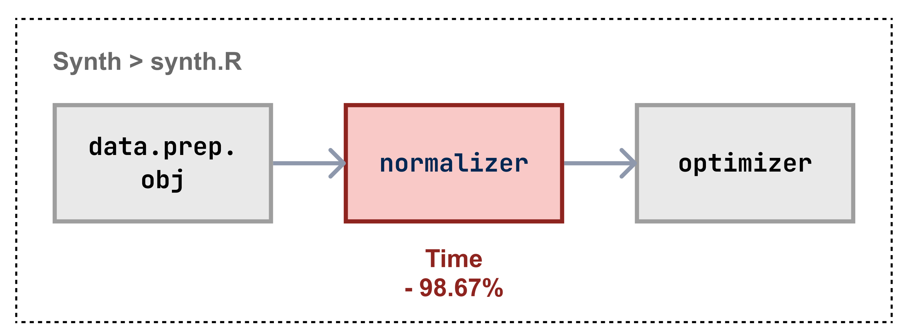
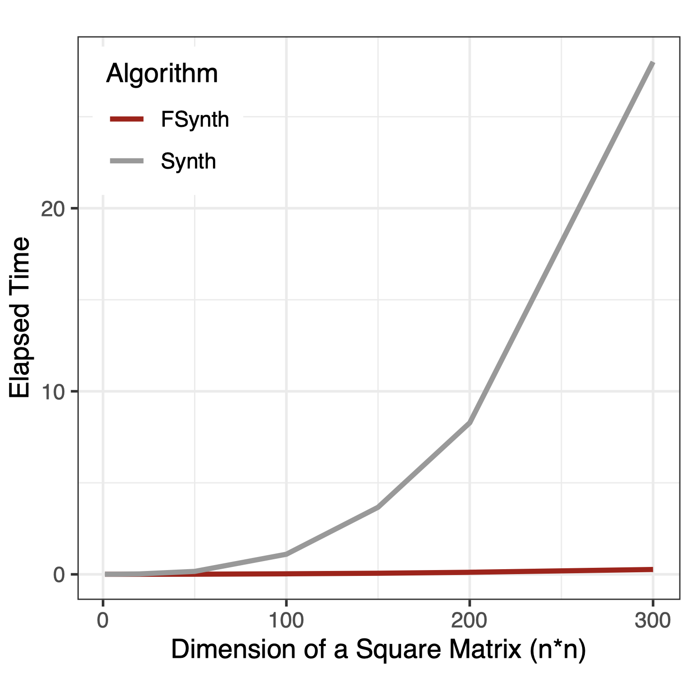
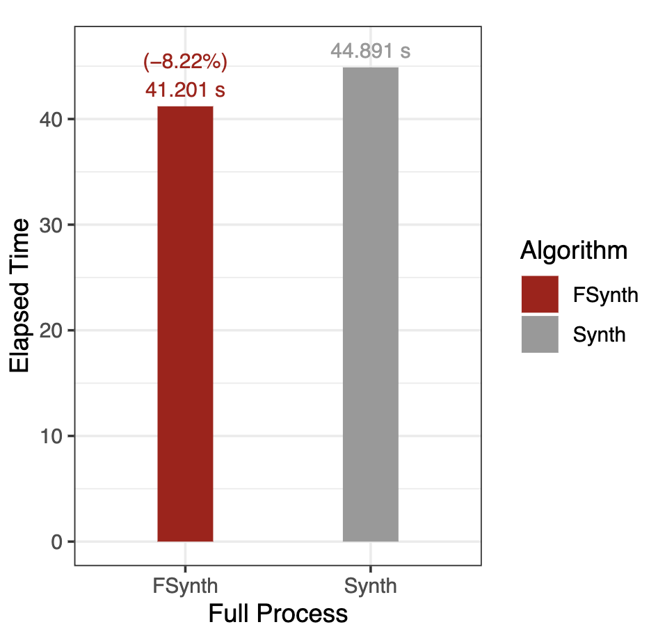

# Faster Synthetic Control

<p align="left">

  
</p>
An R package offering speed enhancements for Synthetic Control.  
  
**Authors:** [Rongxin Ouyang](https://rongxin.me/cv), [Subhayan Mukerjee](https://discovery.nus.edu.sg/19113-subhayan-mukerjee)
**Last Update:** Oct., 2024  

## Usage

1. Clone this repository:
   `git clone https://github.com/reycn/FSynth.git`
2. In R / notebook, load locally

    ```R
    # Install devtools to load local packages
    if (!require("pacman")) install.packages("pacman")
    pacman::p_load(devtools)
    # Load FSynth from a local path
    devtools::load_all("/local/path/to/repo")
    ```

3. Use this package in the same way to the original package, [*Synth*](https://cran.r-project.org/web/packages/Synth/Synth.pdf) ([Abadie, 2010](https://www.jstatsoft.org/article/view/v042i13))

    ```R
    dataprep()
    synth()
    ```

## Performance

- Normalizer: time lapsed - 98.67%, consistently improving with larger datasets
- Full process: -8%

<p align="left">
  
  
  
</p>

## Our Paper

- Link [TBD]

## Citation

- `[TBD]`

## Reference

- [Abadie, A., Diamond, A., & Hainmueller, J. (2011). Synth: An R package for synthetic control methods in comparative case studies. *Journal of Statistical Software*, *42*(13).](<https://www.jstatsoft.org/article/view/v042i13>)
